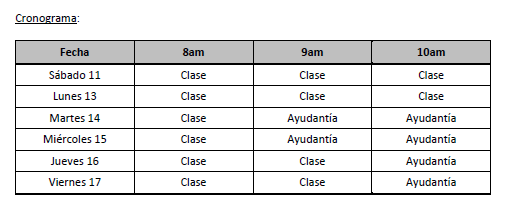





## Descripción del curso

En este curso estudiaremos cómo evaluar hipótesis económicas usando datos. Se estudiará el modelo de regresión lineal como una estimación de la esperanza condicional y sus propiedades

## Profesor



## **Contenidos:**


Te recomendamos revisar el [material complementario](https://econometrics-bch.netlify.app/post/) antes de la primera clase


**Clase 1: (3 horas, capítulos 2 y 3)**

- Regresión como esperanza condicional.

- Estimación del modelo de regresión lineal.

- Propiedades algebraicas del estimador de MCO.

**Clase 2: (3 horas, capítulos 3 y 4)**

- Propiedades estadísticas del estimador de MCO.

- Inferencia sobre un parámetro.

- Inferencia sobre un conjunto de parámetros.

**Clase 3: (1 hora, capítulo 6)**

- Forma funcional y especificación: logaritmos, potencias e interacciones.

**Clase 4: (1 hora, capítulo 7)**

- Variables binarias independientes.

**Clase 5: (2 horas, capítulos 8 y 12)**

- Heterocedasticidad.

- Correlación serial o autocorrelación.

**Clase 6: (2 horas, capítulos 3 y 9)**

- Omisión de variables relevantes

## Bibliografía:

Wooldridge, J. (2015), Introducción a la Econometría: Un Enfoque Moderno. Cengage Learning, 5ta edición.

## Administrativos


El curso supone un nivel de estadística y álgebra lineal equivalente al que se presenta en los apéndices B, C y D del texto de Wooldridge. Pueden encontrar el material de apoyo en la sección ["Materiales"](/post/)



El curso tendrá una duración de 18 horas, distribuidas en 6 clases de 3 horas cada una. Para más información respecto de las horas de clase y ayudantía, por favor revisar el cronograma adjunto



Las clases serán a través de la plataforma Zoom, usando el siguiente link:
https://zoom.us/j/92744480730?pwd=U1FlckhGNE5IZmhvdW50dVNQTjk0UT09
Meeting ID: 927 4448 0730
Passcode: 422648



Los alumnos deberán asistir a todas clases y ayudantías, siempre con sus cámaras encendidas.


## Sesiones en este curso






